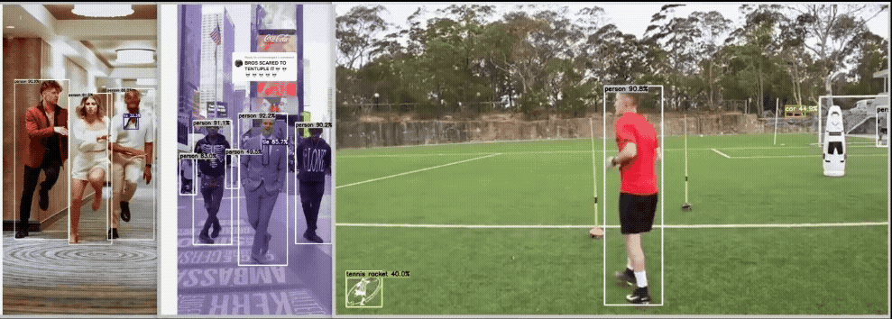
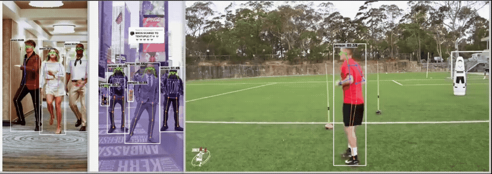
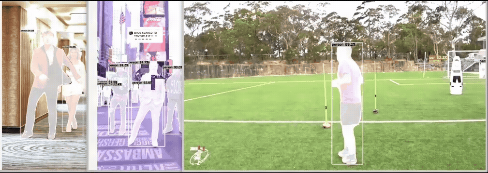

<p align="center">
  
  
  
</p>

<p align="center">
  <sub><b>Object Detection</b> | <b>Pose Estimation</b> | <b>Segmentation</b></sub>
</p>

---

# Deep Learning Inference with TensorRT

`trtinfer` is a library that enables deep learning inference using pre-generated TensorRT engines.  The class is designed to be used with any machine learning model that can be exported to a TensorRT engine.  Batch image inference is supported for models with multiple output tensors (e.g., YOLOv8 segmentation).  

Examples of single input and batch input inference are included in the `examples` folder, including YOLOv8 object detection, YOLOv8 segmentation, YOLOv8 pose estimation, and ResNet50 image classification. It enables running up to `N` images in a single inference pass.

This library consists of a templated abstract `IEngine` class and a templated `TRTEngine`.  The `IEngine` abstract class serves to keep the engine API common between inference engines if there are more than one (e.g. if ONNX runtime inference engine is added). `TRTEngine` is the implementation for the TensorRT engine type.

This library supports engines with FP32 and FP16 weights.  The only template type for the `TRTEngine` class currently supported is `float` (meaning the input and output of the engine is processed as FP32 data type).

Currently this class is best suited for image inference or any model whose input data can be easily represented as an OpenCV `cv::Mat` or `cv::cuda::GpuMat` type.  To use a different model that is not included in the examples you will have to perform your own pre-/post-processing.  It is recommended to use the YOLOv8 or ResNet50 classes in the `examples` folder as references when building your own class to use the `TRTEngine` class to perform pre-/post-processing of detections.

## 🚀 Features

- Simple API: `loadNetwork()`, `runInference()`
- Supports dynamic batch sizes (for models exported with batch support)
- Handles models with multiple inputs/outputs (e.g., segmentation masks, keypoints)
- Example classes for YOLOv8, ResNet50, and more

## ⚠️ Limitations & Scope

- Currently supports models with image-based inputs (e.g., `cv::Mat`, `cv::cuda::GpuMat`)
- Does not provide Python bindings (C++ only)
- Pre- and post-processing must be implemented for custom models (see YOLOv8/ResNet50 examples)

If you need any of these features, consider opening an Issue or PR!

## 🏁 Quick Start

CLI 

```bash
git clone https://github.com/crose72/trtinfer.git
cd trtinfer
mkdir build && cd build

# Update paths to TensorRT engines and image(s)/video(s) in the exampleBatchYOLOv8.cpp or whichever example you want to run before building and running - examples don't use CLI arguments currently

cmake .. && make -j$(nproc)
./examples/exampleBatchYOLOv8/exampleBatchYOLOv8
```

## 🏗 Repository Structure

```
trtinfer/
├── CMakeLists.txt  
├── include/        # Library headers/core implementation
├── src/            # Additional library implementation
├── examples/       # Examples to compile and test (batch YOLOv8, Resnet50, etc.)
├── scripts/        # Docker run/YOLO export scripts
└── README.md
```

## Generating a TensorRT engine

My recommendation for generating a TensorRT engine is to start with a model in ONNX format.  A python script is included in the `scripts` folder which you can use to generate a yolov8 model in ONNX format that supports batch inference.  It's small so it's included here for convenience:

```bash
from ultralytics import YOLO

# Load your YOLOv8 PyTorch model (.pt)
model = YOLO('yolov8s-seg.pt')  # or your specific model (e.g. `yolov8s-pose`, `yolov8s`)

# Export to ONNX with dynamic batch dimension (or dynamic=False if only doing inference on
# a single image)
model.export(format='onnx', dynamic=True, simplify=True, opset=12, imgsz=640)
```

Next, convert the ONNX model you just exported to a TensorRT engine.  Below is an example of how to do this for batch inference with the model weights in FP16 format (FP16 for faster inference with accuracy comparable to FP32 - FYI this doesn't change the input data type, just how the model weights are stored).

```bash
/usr/src/tensorrt/bin/trtexec --onnx=yolov8s-seg.onnx --minShapes=images:1x3x640x640 --optShapes=images:1x3x640x640 --maxShapes=images:16x3x640x640 --saveEngine=yolov8s_seg_batch_fp16.engine --fp16
```

#### *Note: Replace images in --minShapes=images:... with the actual input name in your ONNX model if different. For YOLOv8, it's usually images.

If you're only passing 1 image to the engine at a time then you can use the following arguments

```bash
/usr/src/tensorrt/bin/trtexec --onnx=yolov8s-seg.onnx --saveEngine=yolov8s_seg_fp16.engine --fp16
```

This is not a comprehensive tutorial on generating TensorRT engines, just a couple examples that have worked for me.  If you need different behavior from the engine, please refer to the instructions for your TensorRT version (for TensorRT 10.8.0 [trtexec instructions](https://docs.nvidia.com/deeplearning/tensorrt/10.8.0/reference/command-line-programs.html) - versions keep getting updated, likely similar to other 10.X versions)

A YOLOv8 object detection, pose estimation, and segmentation model have been provided in the `examples/models` folder which have been exported as ONNX files with dynamic batches enabled.

## 📦 Building `trtinfer` & Running the examples

### Install Prerequisites

- C++17 (or newer)
- CMake (≥ 3.x)
- CUDA 12.6 (other versions may work, see NVIDIA compatibility docs)
- cuDNN >= 8.x (tested with 9.3.0)
- TensorRT >= 10.0 (tested with 10.5.0)
- OpenCV 4.7.0+ (tested with 4.10.0) with cuDNN/CUDA module (for matrix ops, mask handling)
- spdlog and fmt for logging/debug

#### *Notes: This library was tested with the above dependencies and their respective versions, though it is possible that some earlier versions of these libraries may be used - you'll have to test it, and potentially modify the code to be compatible - worth a shot if you need it :) Designed to be simple to use.

Install the dependencies listed above.  `spdlog` can be installed on linux with 

```bash
sudo apt-get update && apt install -y libspdlog-dev libfmt-dev
```

### Clone the repo

```bash
git clone https://github.com/crose72/trtinfer.git
```

### Docker containers

Docker containers are not required for this library, but they might make life easier :)

Two docker containers are provided that you can use to test this library and use for your own development.  One docker container is for Ubuntu-22.04 on x86 , and another container for Jetson Orin (Nano/NX/AGX).  These were created for a separate project that uses this library to control an autonomous drone in real time using the Jetson Orin Nano.  All of the dependencies for this project are already installed in the containers.  With the containers, you can just build and run the examples without having to install anything.  These scripts mount the entire repo.  To run the container

```bash
cd trtinfer/scripts

# If running on Jetson Orin (Nano/NX/AGX) with Jetpack 36.4.0 (or close Jetpack version)
./run_dev_orin.sh

# For x86 with GPU that has compute capability sm 8.6 (this sm 8.6 requirement is just an OpenCV with CUDA dependency, you can use the same OpenCV and CUDA versions as long as your install supports your GPU - per NVIDIA documentation)
./run_dev_ubuntu-22.04.sh
```

#### *Note: ```run_dev_ubuntu-22.04.sh``` was built for a specific project and has CUDA enabled OpenCV compiled to be compatible with my computer's GPU (RTX 3060).  So if you have an NVIDIA GPU with compute capability sm 8.6 then it should just work for you.  If your GPU has a different compute capability (much older or much newer GPU) then you can use this docker script as a starting point to build your own container and compile OpenCV with CUDA to support your GPU [Dockerfile.dev_ubuntu-22.04](https://github.com/crose72/OperationSquirrel/blob/master/docker/Dockerfile.dev_ubuntu-22.04).  This container was tested in WSL2.

#### *Note: ```run_dev_orin.sh``` was built for the Jetson Orin (Nano/NX/AGX) and the original build script can be found at [Dockerfile.dev_r36.4.0](https://github.com/crose72/OperationSquirrel/blob/master/docker/Dockerfile.dev_r36.4.0).  If you use Jetson, make sure your JetPack version matches the container, or you may hit CUDA incompatibilities.

### Building the library

After installing the dependencies or running one of the provided containers, and cloning the repository, to build:

```bash
cd trtinfer
mkdir build && cd build
# Add -DBUILD_EXAMPLES=ON to build the examples as well
cmake ..
make -j$(nproc)
```

#### *Note: Update paths to TensorRT engines and image(s)/video(s) in the `exampleBatchYOLOv8.cpp` or whichever example you want to run before building and running - examples don't use CLI arguments currently.  They are defaulted to the paths for the images/videos and TensorRT engines used in testing.

### Running Examples

Still in the `build` folder after compiling the library and examples, run

```bash
# Run an example
./examples/exampleBatchYOLOv8/exampleBatchYOLOv8

# or
./examples/exampleYOLOv8/exampleYOLOv8
```

## 🙏 Acknowledgements

This project builds on the work of several excellent open-source repositories and contributors:

- **[Cyrus Behroozi](https://github.com/cyrusbehr)**
    - [YOLOv8-TensorRT-CPP](https://github.com/cyrusbehr/YOLOv8-TensorRT-CPP) — provided the baseline implementation and inspiration for YOLOv8 TensorRT C++ inference
    - [tensorrt-cpp-api](https://github.com/cyrusbehr/tensorrt-cpp-api) — provided the baseline implementation and inspiration for the TRTEngine C++ class

Many thanks to Cyrus and all open-source contributors whose work made this library possible!
